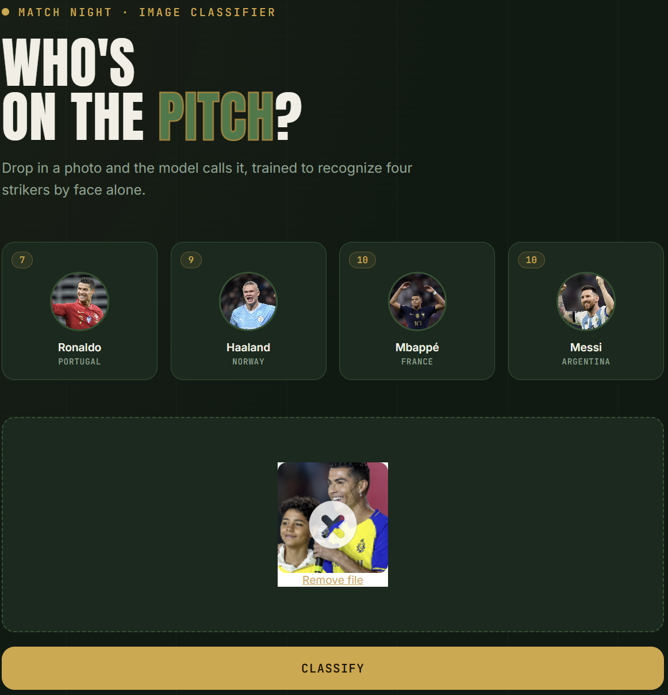
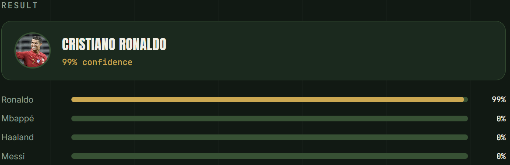

# Football Player Image Classifier

Classifies photos of football players including Cristiano Ronaldo, Lionel Messi, Kylian Mbappé, and Erling Haaland. Uses OpenCV for face detection and wavelet transform features feeding a trained classifier, served via a Flask API with a drag and drop web UI.

# Demo

<p align="center">
  
  <br><br>
  
</p>

## Structure

```
football-player-classifier/
├── model/          # Dataset prep + training notebook, exports artifacts/
├── server/         # Flask API that loads the model and serves predictions
└── UI/             # Static web frontend for uploading test images
```

## Pipeline

**Detect and Crop** OpenCV Haar cascades locate a face and both eyes in the uploaded image. Images where two eyes aren't clearly detected are rejected as unusable.

**Extract features** Each cropped face is represented two ways: the raw resized image (color) and its wavelet transform (edges and texture), concatenated into one feature vector.

**Classify** The feature vector is passed to a trained model (`saved_model.pkl`) that outputs the predicted player and per class probabilities, using `class_dictionary.json` to map indices back to names.

**Serve** `server.py` loads the model and cascades once at startup and exposes a `/classify_image` endpoint that accepts a base64 encoded image and returns the prediction as JSON.

**Display** The UI accepts a dropped image, sends it to the API, and renders the predicted player with confidence scores.

## Getting Started

**1. Train the model**
```bash
cd model
jupyter notebook Football_Players_Classification.ipynb
```
Outputs `artifacts/saved_model.pkl` and `artifacts/class_dictionary.json`.

**2. Run the server**
```bash
cd server
pip install -r requirements.txt
python server.py
```
Starts the API at `http://localhost:5000`.

**3. Open the UI**
```bash
cd UI
open app.html
```
Confirm the API URL in `app.js` matches your running server, then drop in an image to test.

## Tech Stack
Python, OpenCV, PyWavelets, scikit-learn, Flask, HTML/CSS/JS, Dropzone.js

## Notes
- `model/dataset/`, `test_images/`, and `artifacts/` are gitignored. Raw images and binary model files aren't tracked in version control.
- Add your own player images to `model/dataset/<player_name>/` and re-run the notebook to extend the classifier to new players.
